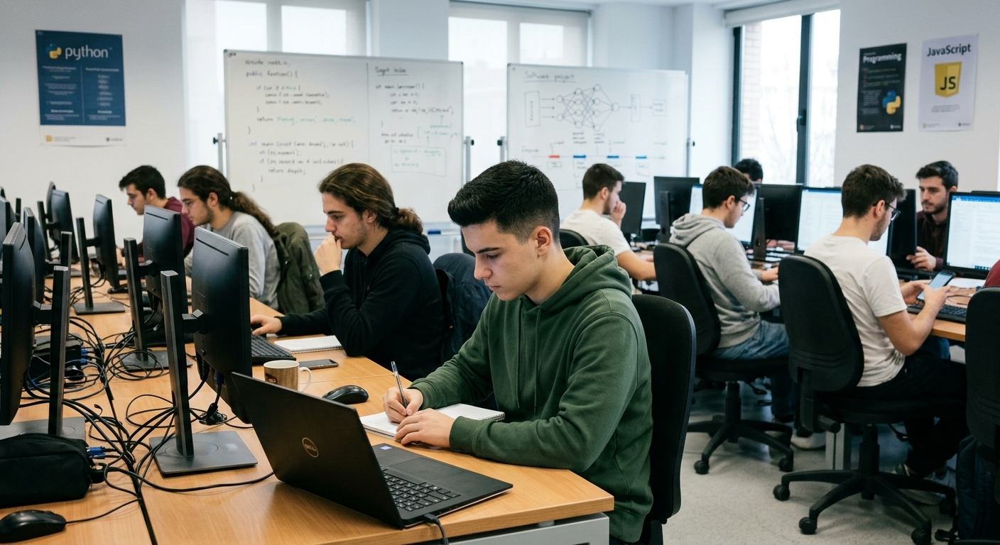

# pyton
SMR 2

# **HOLA !SOY YASIN¡**

### Soy alumno de grado medio 2, mi profesora es Sonia una profesora muy maja y agradable, y espero llevarme bn con ella y sacar buenas notas este año.
:smile:

## Mis Gustos
* Programar :computer:
* Aplicaciones ofimaticas :rocket:
* GYM
* Futbol

[Mi pueblo](https://www.google.com/url?sa=t&source=web&rct=j&opi=89978449&url=https://www.navalafuente.org/&ved=2ahUKEwic2pX4wfCWAxXYbqQEHaUbOkEQFnoECHMQAQ&usg=AOvVaw2PJ_DHWuTOI0eANqHaUW3s)

:rocket: :smile: :heart: (assets/ mi pueblo.jpg)

## MI TABLA
#### MIS COMPAÑEROS DE CLASE
| Nombre | Edad | Curso |
|---|---:|---|
| Aarón | 17 | 2º GRM  |
| Khalid | 32 | 2º GRM  |
| Rocha | 18 | 2º GRM |
